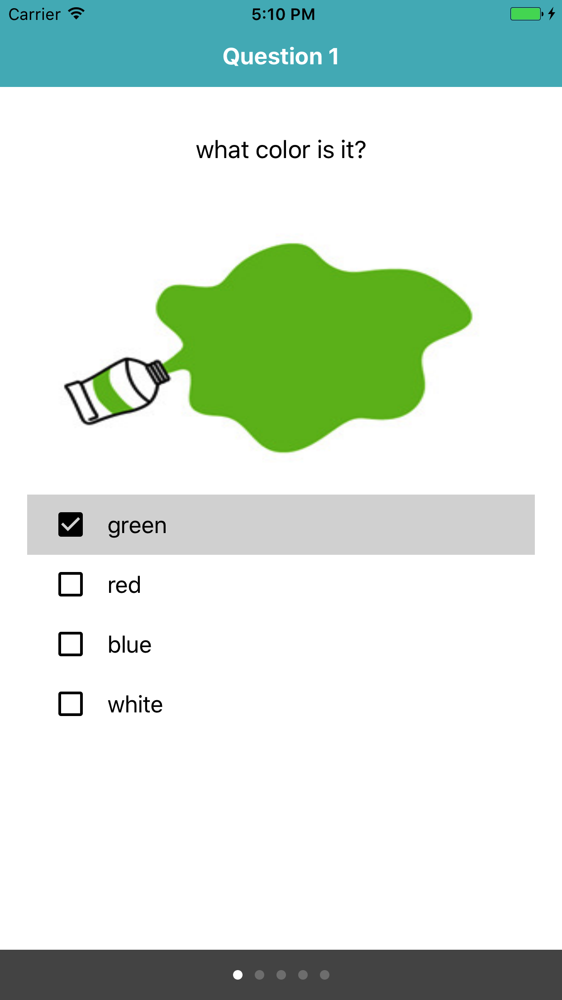
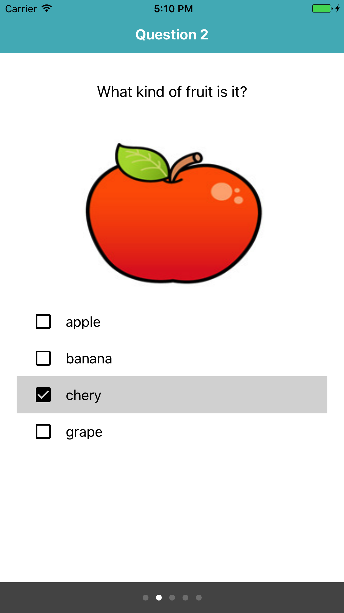
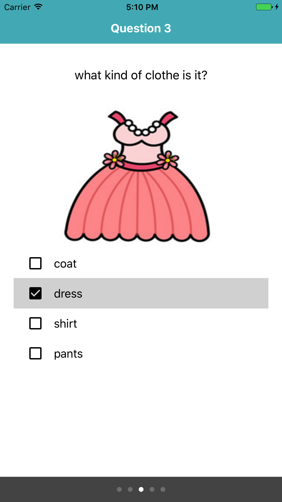
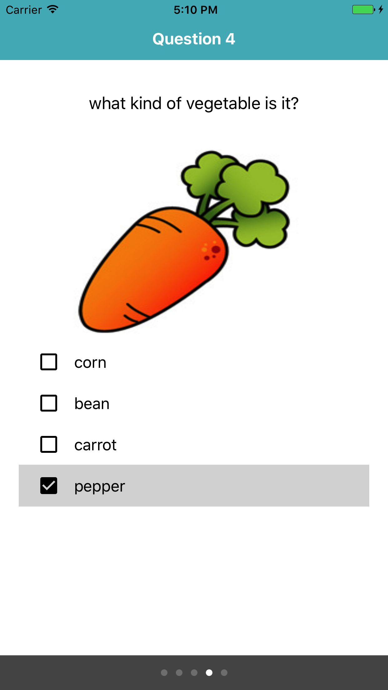
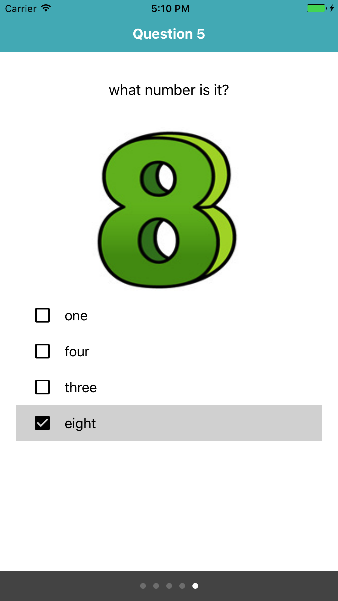
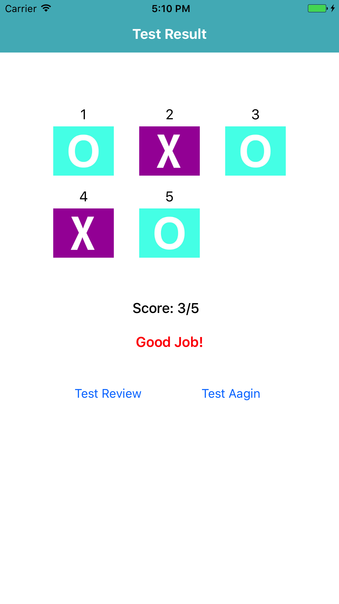

# Project Name : Vocabulary Study For a Child 

## Features

This is a personal project for implementing a iOS app which features like

- Read XML
- Answer / Move Question Pages  
- View TestResult  

## Screenshot

  
  
  

  
  
  

